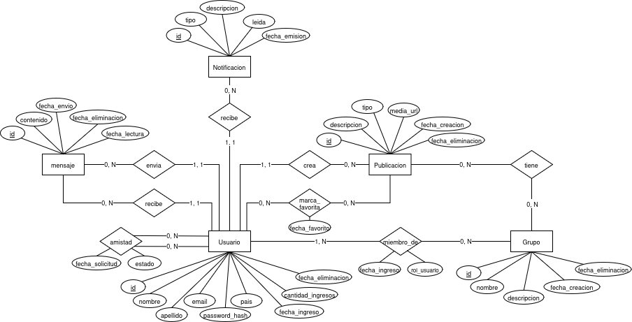

# Social Network Relational Database
Un diseño de base de datos relacional robusto y normalizado para una plataforma de red social. Este proyecto maneja la gestión de identidades, relaciones de amistad mediante máquinas de estado, grupos de interés, mensajería directa y publicaciones multimedia.

## Características Principales

* **Gestión de Usuarios y Seguridad:** Implementación de perfiles de usuario con almacenamiento simulado de contraseñas mediante hashes (PBKDF2/SHA256).
* **Ciclo de Vida de Amistades:** Sistema de conexiones con control de estados (`pendiente`, `aceptada`, `bloqueada`).
* **Borrado Lógico (Soft Deletes):** Arquitectura pensada para analítica y auditoría, evitando la pérdida de datos históricos al dar de baja registros mediante el uso de `fecha_eliminacion`.
* **Almacenamiento Multimedia Optimizado:** Desacoplamiento de archivos binarios utilizando referencias a URLs (S3/Cloud) para mejorar el rendimiento del motor relacional.
* **Integridad Referencial:** Uso exhaustivo de claves foráneas con borrado en cascada controlado y restricciones `CHECK` para aplicar reglas de negocio a nivel de base de datos.

## Arquitectura de Datos

El diseño sigue las normativas de la Forma Normal de Boyce-Codd (FNBC) para evitar redundancias y anomalías de actualización.



## 🛠️ Stack Tecnológico

* **Motor de Base de Datos:** PostgreSQL
* **Lenguaje:** SQL (DDL y DML)

## 💻 Instalación y Uso

Instrucciones para levantar el esquema y los datos de prueba en un entorno local (testeado en Ubuntu 24.04).

```bash
git clone git@github.com:gonzalaos/social-network-rdbms.git
cd social-network-rdbms

psql -U postgres

\i schema.sql
\i seed.sql
\i queries.sql